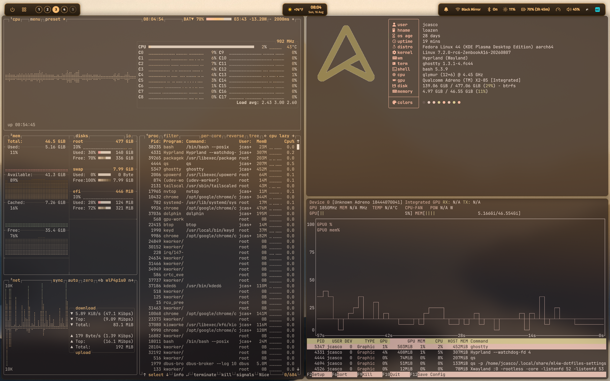

# Linux on the ASUS Zenbook A16 (Snapdragon X2 Elite Extreme)

Mainline-based Linux bring-up for the **ASUS Zenbook A16 (UX3607OA)** — a Windows-on-ARM
laptop built on the **Qualcomm Snapdragon X2 Elite Extreme**, SoC codename **glymur**,
Adreno X2 GPU.



**Status: a working daily driver.** Display, GPU, Wi-Fi, Bluetooth, audio, battery,
Type-C/DisplayPort alt-mode, input, NVMe, CPU frequency scaling, thermal management and
suspend all work together on one kernel and one device tree. Fedora 44 KDE aarch64 is what
it runs day to day.

> **2026-08-17 — running on current linux-next snapshot (`next-20260817`).** `next-20260817`
> (7.2-rc6) boots cleanly with our 13-patch series. The total diff is 14 files (+1458/-52),
> dominated by the reconciled upstream DTS sync (1130 lines), with under 350 lines of
> actual functional kernel/driver changes. Upstream momentum is strong; I'll continue tracking
> `linux-next` closely, validating on bare metal, and submitting clean, generic fixes to the
> relevant subsystem mailing lists as remaining hardware support falls into place.

---

## Start here

| If you want to… | Read |
|---|---|
| know whether a given component works, with a check you can run | [`docs/hardware.md`](docs/hardware.md) — **authoritative**; where it and this file disagree, it wins |
| build and boot it yourself | [Building and booting](#building-and-booting) |
| understand *why* something is the way it is | [CHANGELOG.md](CHANGELOG.md) — history, root causes, and the conclusions that turned out to be wrong |
| see what is carried on top of upstream, and why | [`docs/modifications.md`](docs/modifications.md) |
| know whose upstream work this tree carries | [UPSTREAM-CREDITS.md](UPSTREAM-CREDITS.md) |
| contribute or correct something | [CONTRIBUTING.md](CONTRIBUTING.md) |

---

## Please read

**This project was heavily AI-assisted, and I am not a kernel developer.** I want to be
very clear about that. I'm a hobbyist who can only stomach Windows during the work week,
and I bought this laptop because I'm a firm believer in ARM as the future of mobile
computing — even on Windows, it's a great machine.

Most of the analysis, device-tree bisection, reverse-engineering and write-ups here were
produced with AI assistance and then tested on real hardware. The AI was wrong plenty of
times along the way, and where a conclusion was later disproved the record of that is kept
rather than quietly deleted. **Your mileage may vary:** these are the things that worked on
my specific device. Register addresses, StreamIDs and root-cause theories are
reverse-engineered and experimental.

I'm publishing anyway because the machine is genuinely usable today and others should be
able to share that — and because I'd love people who *actually* know this stack to
validate it, correct me, and push it further. **If you know the Adreno/DPU/clock-controller
stack, your review and patches are wanted.** If something here is wrong or dangerous,
please open an issue; I'll take the correction gladly.

---

## Current phase: upstream-first

For most of its life this project existed because there was no in-tree support for this
laptop. **There is now.**

Konrad Dybcio's board file was merged as `e8fbbca94db7 arm64: dts: qcom: glymur: Add Asus
Zenbook A16 (UX3607OA)` and is in linux-next as of `next-20260803`, reviewed by Abel Vesa
and Dmitry Baryshkov, applied by Bjorn Andersson. The binding landed with it, and both
prerequisites that had blocked it (`remoteproc_soccp`, `pcie4_port0_ep`) landed by
`next-20260731`, so it builds standalone.

That makes the old goal — maintain a rival device tree — obsolete. The goal now is to
**shrink this repository into upstream**: reconcile our board file against the merged one,
send the fixes that are genuinely generic, and report what upstream cannot yet do on real
hardware. Expect `dts/` here to get smaller, not bigger.

### Baseline diff summary (`next-20260817`)

Total diff across the 13 commits against vanilla `next-20260817` is 14 files, +1458/-52 lines:
- **DTS sync (1130 lines)**: Reconciling the A16 board file against upstream's merged DTS (`0007`) and tracking the `pcie4_port0_ep` label rename (`0008`), carrying forward local fixups (`regulator-always-on` for WCN 3.3V rail, `wcn7850-pmu` node).
- **Functional kernel delta (<350 lines)**:

| Area | Commit / Patch | Lines | Upstream status |
|---|---|---|---|
| SCMI | Polling mode (`arm,no-completion-irq`) | 1 property | Sent, already upstream-track |
| DRM/eDP | `LINK_RATE_SET` reachability & clear `LINK_BW_SET` | +29 | Sent (generic msm bug) |
| DRM/eDP | `push_idle` guard on unpowered link | +14 | Sent (generic msm bug) |
| DRM/eDP | **LOCAL:** Force HBR3 on internal panel | +24 | Not proposable (drives above sink max; PHY gap) |
| PCI | **LOCAL:** `glymur_pci_skip` s2idle workaround | +17 | Not proposable (diagnostic knob in production) |
| HID | Complete Zenbook keyboard feature set | +174 | Upstreamable with cleanup |
| DTS | Board file sync with merged upstream | +1110 | Reconciled board file |
| DTS | Use existing `pcie4_port0_ep` label | -14 | Tracks upstream rename |
| Audio | `q6apm`/audioreach fast-retry on SPF state | +83 | Local timing fix, unsent |
| Audio | SoundWire device0 alert, clash recovery & attach count | +51 | Local fix, tested on hardware |
| Audio | SoundWire direct reprobe on probe deferral | +61 | Local probe deferral fix |
| Security | Include `asn1_decoder.h` in `trusted_tpm2.c` | +1 | Genuine upstream bug fix (`CONFIG_TRUSTED_KEYS=y`) |
| Housekeeping | Drop `localversion-next` | -1 | Cosmetic |

Full patch set with headers: [`patches/next-20260817/`](patches/next-20260817/).

## The deltas that matter

Everything above rests on a small number of changes. If you reproduce nothing else,
reproduce these.

1. **eDP: force HBR3.** The v8 eDP PHY on this SoC brings up a usable link **only at
   8.1 Gbps**. Measured 2026-08-07 by forcing each rate in turn on otherwise identical
   kernels:

   | link rate | clock recovery | equalization | result |
   |---|---|---|---|
   | 1620 (RBR) | fail | — | no link |
   | 2700 (HBR) | fail | — | no link |
   | 5400 (HBR2) | pass | **fail** | no link |
   | **8100 (HBR3)** | pass | pass | **panel lights, first attempt** |

   The panel (SDC `ATNA60HR07-0`) advertises **HBR2 as its maximum** — in both the eDP
   `SUPPORTED_LINK_RATES` table and the extended receiver caps at DPCD `0x2201` — so an
   unmodified kernel correctly selects HBR2, the one rate that cannot train, and the screen
   stays black. Our tree overrides the rate to the device-tree ceiling.
   ⚠️ **This override is deliberately not proposed upstream**: it drives the link above the
   sink's advertised maximum. The real fix belongs in `phy-qcom-edp.c` and has been reported
   to its author. `phy-qcom-edp.c` is byte-identical at `next-20260713` and `next-20260803`,
   so this is a long-standing gap, not a regression.

2. **`drm/msm/dp`: don't push idle into a link that was never enabled.** When eDP training
   fails, `msm_dp_display_atomic_enable()` returns early leaving `->power_on` false, but
   `msm_dp_display_atomic_disable()` writes `DP_STATE_CTRL_PUSH_IDLE` anyway. Elsewhere the
   teardown is gated on that flag; this one write is not. On glymur it is fatal — TrustZone
   force-stops the SOCCP and ADSP and the SoC resets silently ~50 ms later, no oops, no
   panic. Reproducible with no compositor and no GPU involved:
   `echo 1 > /sys/class/graphics/fb0/blank`. A one-line guard fixes it. This one **is**
    generic and is being sent upstream.

   A separate, upstream-fixed **DPMS-on** wake reset — a zero-rate `dev_pm_opp_set_rate()`
   in `dpu_core_perf.c`, guarded in `next-20260807` — is recorded in
   [`CHANGELOG.md`](CHANGELOG.md); together the two guards close both reset directions.

3. **`arm,no-completion-irq` on the `scmi` node** — one property. The PDP0/CPUCP firmware
   writes correct replies for the SCMI Performance protocol into shared memory but never
   rings the mailbox doorbell, so every transfer times out and `scmi-cpufreq` probes `-110`.
   Without this the CPUs stay pinned at boot clock. In [`patches/`](patches/).

4. **Remove `com_aux` from the `phy@88e1000` clock list** — the QMP combo PHY enables a
   `com_aux` clock on an instance that has no USB half, and `phy_init()` fails `-EBUSY`.
   Removing it takes HDMI EDID from 0 to 512 bytes and modes from 0 to 32, and removes a
   compositor hang. Still present upstream.

5. **`glymur_pci_skip=5`** — PCI config-space access during `dpm_suspend_noirq()` resets
   this SoC, read and write paths independently. This skips both. A **diagnostic
   workaround, not a fix**, and deliberately not proposed upstream.

6. **`systemd.mask=dev-tpm0.device dev-tpmrm0.device`** on the kernel cmdline — required,
   not cosmetic. Without them the boot stalls about 90 seconds.

---

## What works

| | |
|---|---|
| **Display** | Native eDP, DPU-driven, 2880x1800@120 at 30 bpp, `fb0 = msmdrmfb`. Backlight over DP AUX. **HBR3 only** — see delta 1. |
| **GPU** | Adreno X2 under Mesa **turnip**. GMU firmware v5.2.38, `gpucc` 25 clocks, devfreq 310 MHz → 1.85 GHz across 12 OPPs. |
| **CPU frequency** | Three SCMI performance domains, 355 MHz → 3.61/4.45 GHz, `scaling_driver = scmi`, `schedutil`. |
| **Thermal** | 41/41 CPU zones bound to `cpufreq-cpu0/6/12`, plus 14 GPU zones. Actuation verified. |
| **Wi-Fi / Bluetooth** | ath12k (QCC2072) and WCN7850 BT over UART14 (`hci0` initialized natively). |
| **Audio** | 4× WSA8845 speakers (SoundWire) + internal DMIC capture. Native ALSA UCM2 profile with card name aliases, SoundWire bus clash auto-enumeration recovery, stereo [FL FR] routing via WirePlumber, hardware sink sync, and background EasyEffects audio enhancements. |
| **Battery / charging** | Over USB-C PD, via the SOCCP GLINK path → `qcom-battmgr`. ⚠️ `qcom-battmgr-ac/online = 0` is *correct* — that barrel-jack rail does not exist on this laptop. |
| **Type-C** | UCSI, PD negotiation, orientation detection, **DisplayPort alt-mode on both ports**. |
| **Input** | Keyboard (i2c-HID, ASUS EC) + dimmable backlight (`asus::kbd_backlight`, 0–3), trackpad, touchscreen + stylus, lid switch. |
| **Storage** | NVMe, Gen4/Gen5 PHY, boots from the internal SSD. |
| **Fan** | RPM readback via the EC on i2c-9. |
| **RTC** | `/dev/rtc0` counts. ⚠️ Read-only, no wake alarm, free-running counter — the epoch offset is restored from userspace. |

## What partly works

- **Suspend / resume** — works on a workaround, and two resume failures remain.
  s2idle completes and the machine wakes, but stock it hard-resets the SoC (delta 5), which
  leaves PCI devices powered through sleep — it sleeps, but saves less power than a correct
  implementation. This reproduces on the bare upstream A16 device tree, so it is a platform
  gap rather than a defect in ours, and a firmware revision is needed for a real fix.
  On resume, two devices do not come back on their own: **xHCI** (suspends with the HS-PHY
  not in L2 → stale ring → SMMU translation fault → fatal Host System Error) and **ath12k**
  (MHI reaches the device but never reloads AMSS, on sleeps beyond roughly 2.5 minutes).
  Both are handled by a recovery hook; neither is fixed.
- **HDMI** — the PHY is fixed (delta 4), the port is not. The output is still black because
  nothing delivers HPD to `af64000`. Four approaches eliminated; TLMM 126 cannot be a GPIO
  without killing USB-C DP alt-mode.
- **SPMI** — all three buses enumerate and `qcom-spmi-temp-alarm` is bound on nine PMICs.
  One device, `2-0b` on `spmi_bus2`, fails `-5`.
- **Fan control** — RPM readback only. `/sys/class/pwm` is empty and the cause is
  unidentified. SPMI is *not* why; that coupling was never true.

## What doesn't work

- **Camera** — no `/dev/video*`. `camcc` now probes (94 clocks), which was step one, but
  CAMSS has no support for this SoC generation: `x1e80100` is supported and glymur is a
  delta from it, but no upstream device tree has a camss node for *either* SoC, and the
  sensor ASUS fitted is still unidentified — it does not appear in the Windows DSDT. This
  is a driver port, not a device-tree job.
- **GPU zap shader** — the DT node is correct and does remove the `-ENODEV` fallback, but
  TrustZone then rejects the upstream-signed image (`-EINVAL`), and `a8xx_gpu.c` tolerates
  only `-ENODEV`, so adding the node costs the entire GPU. The `SECVID_TRUST_CNTL` fallback
  is correct on this machine. Not fixable from Linux.
- **USB4 / Thunderbolt** — blocked upstream. `drivers/thunderbolt` has no Qualcomm support
  and the host-router binding is an unmerged RFC. The Type-C half of the pipeline works.
- **Headphone jack, DP audio** — needs an rx-macro/WCD9395 codec node in the device tree.
  The `wcd939x` driver is in-tree, so this really is just DT.
- **GPU instrumentation** — `nvtop`/`btop` report memory, temperature and power as N/A.
  An integrated Adreno has no dedicated VRAM, there is no hwmon node and no power sensor.
  The temperatures do exist, as 14 thermal zones under `/sys/class/thermal/`.
- **Some Fn hotkeys** — Fn Lock, mic-mute LED, and the camera key are unwired. The two
  ASUS buttons do map.

## Dead ends — do not re-run these

- **`video=simplefb:off` / forced `video=eDP-1:` modeset** — MDSS GDSC power-cycle → warm
  reset.
- **msm_gem CMA rewrite** — solved the wrong problem; SMMU translation was never the fault.
- **Grafting hamoa (x1e) GPU/GMU/IOMMU nodes without `gpucc`** — immediate SError from
  unclocked register access.
- **Gunyah/hypervisor "handshake" emulation for the GPU** — the GPU is driven natively by
  Windows, not behind a Gunyah VMID.
- **100 kHz I2C for the EC keyboard bus** — regresses vs 400 kHz (GENI master command
  timeout).
- **`d3cold_allowed=0` for the ath12k resume failure** — moves the failure one MHI stage
  earlier rather than fixing it.
- **Selecting eDP HBR2 "correctly"** — clearing `LINK_BW_SET` so `LINK_RATE_SET` is honoured
  is right per eDP 1.4b, and it makes things *worse* here: it lands the link squarely on
  HBR2, which cannot train (delta 1). `patches/glymur-edp-rate-set-UPSTREAM.patch` does
  exactly this. ⚠️ **Despite its filename it is not submittable** and should not be sent.

---

## Hardware

| | |
|---|---|
| **Model** | ASUS Zenbook A16, UX3607OA |
| **SoC** | Snapdragon X2 Elite Extreme, `glymur` (X2E94100) |
| **GPU** | Adreno X2, `QCOM0F36` @ `0x03D00000` |
| **Panel** | Samsung/SDC `ATNA60HR07-0`, 2880x1800, 60/120 Hz, 10 bpc, DSC 1.2 capable (eDP) |
| **Wi-Fi** | Qualcomm QCC2072 (ath12k) |
| **Audio** | 4× WSA8845 smart speakers (SoundWire) + DMIC array, LPASS/AudioReach |
| **Firmware** | Retail Windows-on-ARM UEFI (locked; no engineering unlock) |

Full register and bus map: [`docs/hardware.md`](docs/hardware.md).

## Kernel base and device tree

The daily driver is **7.2.0-rc6** (`next-20260817`) on a linux-next base, validated as of
2026-08-17 with the 13-patch series in [`patches/next-20260817/`](patches/next-20260817/);
it replaced the earlier `next-20260807` baseline. v7.1 still boots as a fallback and its patch
set is in [`kernel/`](kernel/); use it to reproduce anything dated before 2026-07-28.

The device tree is Konrad Dybcio's A16 board file with our fixes layered on top —
[`dts/glymur-asus-zenbook-a16-ux3607oa-merged.dts`](dts/).

Because upstream has no Adreno X2 or DPU support for this SoC, the Windows-on-ARM stack was
reverse-engineered to recover hardware ground truth: the ACPI dump (IORT/DSDT/SDEV) gave
authoritative SMMU StreamIDs and register bases, and Ghidra analysis of the Windows WDDM
driver gave GPU identity and firmware blob names. Those documents contain addresses and
register maps **derived** from proprietary Qualcomm/ASUS firmware; the binaries themselves
are **not** redistributed here (see [`firmware/README.md`](firmware/README.md)). This is
interoperability research.

## Building and booting

1. **Kernel** — mainline **v7.2-rc6** (`next-20260817`) (or v7.1) plus the config recipe and patches in
   [`patches/next-20260817/`](patches/next-20260817/) (or [`kernel/`](kernel/)). The recipe starts from a distro config and force-enables the
   glymur boot-critical drivers.
2. **Device tree** — build a DTB from [`dts/`](dts/), **plus the one-line
   `arm,no-completion-irq` property** from
   [`patches/glymur-scmi-no-completion-irq-CONFIRMED.patch`](patches/), without which the
   CPUs stay pinned at boot clock.
3. **Boot** — GRUB + `dtbloader`; sample entries in
   [`boot-kit/grub.cfg.laptop.example`](boot-kit/). One baseline entry carries both the
   suspend workaround and the cpufreq DTB, with previous baselines kept one keypress down
   as fallbacks. Keep a known-good entry as the saved default — a bad DTB can otherwise
   leave the machine unbootable.

Distro installer ISOs: [`iso/README.md`](iso/README.md).

## Repository layout

```
dts/        Device-tree sources (*-merged*.dts = daily driver; testNN = historical)
prebuilt/   Prebuilt DTB for the daily driver
boot-kit/   Build/patch/deploy scripts + example GRUB config
kernel/     Kernel build recipe, config fragment, patches, fork-push script
patches/    Kernel/DT patches: *-UPSTREAM (submittable), *-CONFIRMED (proven on
            hardware), *-EXPERIMENT (untested), *-DIAGNOSTIC (instrumentation only)
            ⚠️ glymur-edp-rate-set-UPSTREAM.patch is misnamed — see Dead ends
tweaks/     Userspace config installed on the machine; tweaks/retired/ = removed, with why
docs/       Component reference, hardware map, display + GPU findings
iso/        Reproducible aarch64 installer-ISO build scripts (Arch / Fedora / Ubuntu)
firmware/   What firmware is needed and where it comes from
```

---

## Credits and license

**→ [UPSTREAM-CREDITS.md](UPSTREAM-CREDITS.md) names every upstream author whose work this
tree carries, with the patch and message-id it came from.** Anything adopted from upstream
is credited there and is never presented as ours.

Upstream Zenbook A16 device tree and base keyboard support are by Qualcomm maintainer **Konrad Dybcio**. Glymur display and eDP PHY v8 support are by **Abel Vesa**.

Builds on mainline Linux, the Linaro/Qualcomm `qcom-next` efforts, and the broader
Snapdragon-on-Linux community — the x1e80100 "hamoa" laptops were the reference skeleton
for much of this bring-up.

Kernel-derived sources (DTS, C, patches) are **GPL-2.0-only**, matching the Linux kernel.
Documentation is provided as-is for research and interoperability. See [LICENSE](LICENSE).

**Disclaimer:** experimental, unofficial, not affiliated with or endorsed by ASUS or
Qualcomm. Running this can leave the machine unbootable until you restore a known-good boot
entry. Proceed at your own risk.
