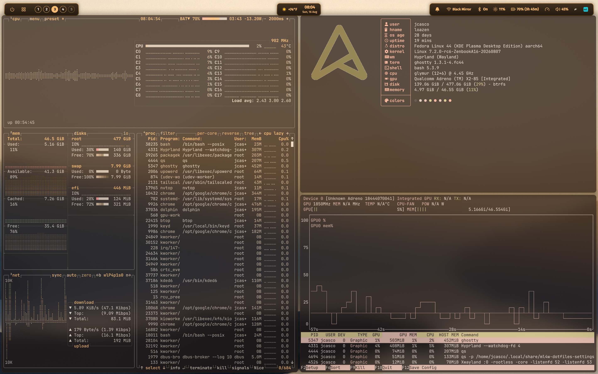

# Linux on the ASUS Zenbook A16

Mainline-based Linux bring-up for the **ASUS Zenbook A16 UX3607OA**, powered by
Qualcomm Snapdragon X2 Elite Extreme (`glymur`).

## Current status — 2026-09-30

**Working baseline: `7.3.0-rc3-ZenbookA16-20260919-rc3-integrated1+`, transitioning to Linux `v7.3-rc4`.**
This is the selected daily-use kernel on Fedora 44 aarch64, with ML4W/Hyprland.
It combines the Linux v7.3 release candidate baseline, selected backports and local fixes.

The desktop is usable, but audio recovery, suspend and abrupt resets remain open.

| Area | Current position |
|---|---|
| Display, GPU, input, NVMe | Operational; display teardown `PUSH_IDLE` fix is merged into upstream mainline 7.3 (`e249a6e2a130`). |
| CPU and thermal | SCMI frequency scaling and 42 CPU/LLC thermal bindings present. Earlier stalls and spontaneous resets still need long-duration validation. |
| Embedded Controller | Konrad Dybcio's EC v3 series validated on hardware and promoted into the baseline stack; HID retains keyboard backlight ownership. |
| Wi-Fi | Operational; regulatory timeouts persist. Resume remains a separate validation task. |
| Bluetooth | Controller active using the driver's original-firmware fallback; the optional patch file is missing. |
| Battery and charging | Operational through native SOCCP attachment and qcom-battmgr. The old standalone soccp_glink loader is retired. |
| Speakers | Native UCM exposes four channels. Front-left silence occurred after boot; manually cycling the audio device restored output. Durable boot/idle recovery is not proven. |
| Microphones | HiFi capture device present; full recording validation on this build remains open. |
| Boot/session | Startup improved from 50.8 s to 15.6 s on the measured host. UWSM manages the session; duplicate notification startup was corrected. |
| Suspend/hibernate | Windows WHEA and Linux AER point to PCI segment 5. The trace build boots cleanly; the suspend test is pending. Hibernate is disabled and untested. |
| Camera | PMH0104 camera LDOs (`ldo4`, `ldo7`) staged in the kernel stack; OV02C10 wiring ready for bring-up. |
| HDMI, USB4, jack/DP audio | Not validated as working; see the hardware reference. |

### EC v3 promotion

The ASUS Zenbook A16 EC v3 series from Konrad Dybcio, paired with our local
patch leaving keyboard-backlight ownership with the ASUS HID driver
([`patches/rc3-ec-v3-hid-20260923/`](patches/rc3-ec-v3-hid-20260923/README.md)),
has been validated in daily use on the test kernels (`usbdiag2ecv3hid1+`, `usb1hubdiag1+`)
and is promoted into the active integration series.

## Start here

- [Current build and validation limits](docs/current-build.md)
- [Hardware reference](docs/hardware.md)
- [Changes and historical corrections](CHANGELOG.md)
- [Kernel and device-tree modifications](docs/modifications.md)
- [Upstream credits](UPSTREAM-CREDITS.md)
- [Contributing](CONTRIBUTING.md)

The current-build record takes precedence over older success claims in component
notes. Historical results describe their original kernel, not an RC3 retest.

## Next priorities

1. Package and verify the integration stack against Linux `v7.3-rc4`, dropping the mainline DP patch.
2. Bake EC v3 and PMH0104 camera LDOs into the promoted kernel build.
3. Validate all four speakers across cold boots and idle/playback transitions.
4. Begin OV02C10 camera bring-up on `cci1_i2c0` with PMH0104 LDO rails.

## Building and booting

The [RC3 build package](kernel/rc3-20260919/README.md) contains the exact config,
an ordered 24-patch series, checksums and a source-tree replay verifier.
[The build record](docs/current-build.md) covers integration and validation.
The older [`next-20260817` series](patches/next-20260817/), merged DTS snapshots
and prebuilt DTBs are historical references, not substitutes for this build.

Use matching kernel, modules, DTB and initramfs artifacts. Include the board's
ADSP firmware and audio topology in the initramfs. Most required blobs are now
in upstream linux-firmware; see [firmware guidance](firmware/README.md).

The tested GRUB setup loads an explicit DTB and requires top-level `insmod fdt`.
Audit the live boot path, back up its source configuration outside `/etc/grub.d/`,
and review a generated configuration diff before installing it. Retain a
known-good fallback and use a distinct release for each hardware experiment.

[Live-image tooling](iso/README.md) is a separate track; it is not validation
of the current laptop baseline.

## AI assistance

**This project is AI-assisted, and I am not a kernel developer.** AI helps with
analysis, device-tree work and documentation; hardware tests determine whether
a change works. Incorrect conclusions are retained with corrections in the
project history. Reviews and reproducible bug reports are welcome.

## Repository layout

| Directory | Contents |
|---|---|
| `dts/`, `prebuilt/` | Board sources and historical DTB snapshots |
| `kernel/`, `patches/` | Build guidance, backports and local experiments |
| `boot-kit/` | Boot tooling and example configurations |
| `tweaks/` | Userspace configuration; retired workarounds are kept separately |
| `scripts/` | Hardware checks and diagnostic tools |
| `docs/` | Component reference and build status |
| `iso/` | Live-image assembly tooling |
| `firmware/` | Firmware requirements and extraction guidance |

Patch filenames alone do not establish upstream readiness or hardware validation.

## Credits and license

See [UPSTREAM-CREDITS.md](UPSTREAM-CREDITS.md) for authorship and provenance.

Kernel-derived sources are **GPL-2.0-only**; see [LICENSE](LICENSE).
This is unofficial interoperability research, not endorsed by ASUS or Qualcomm.
Experimental kernels and device trees can make the machine unbootable; keep a
recovery path.
